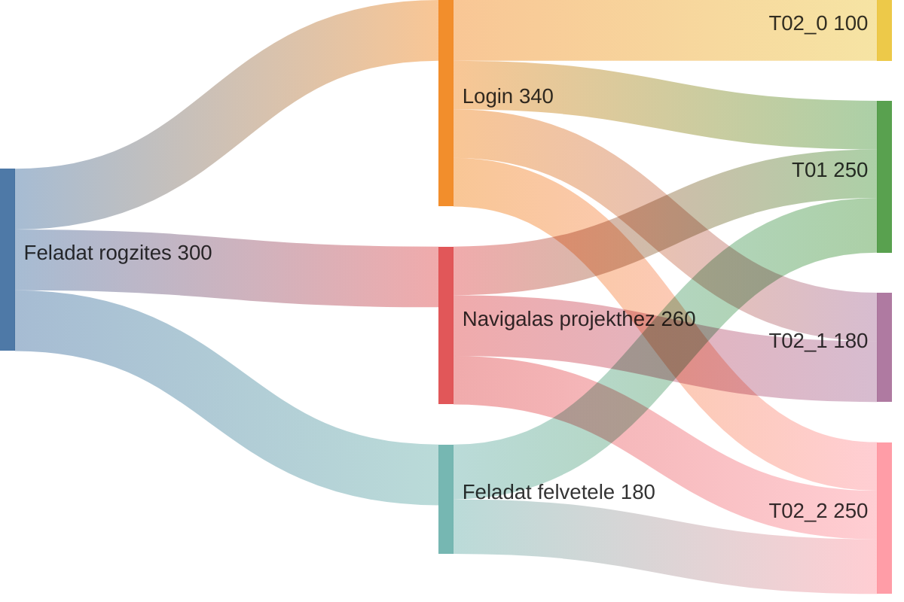

# de-e2e-pw
E2E tesztelési tananyag - PlayWright 

## Előfeltételek
- b1 branch-en található előkészületek, feladatok végrehajtása.

### Do not Repeat Yourself

> Hát maga megbolondult,  
> Hát maga megbolondult,  
> Hogy mindent kétszer mond, kétszer mond?  
>  
> [Karinthy Frigyes: Ady Endre TÖRPE-FEJŰEK](https://www.arcanum.com/hu/online-kiadvanyok/Verstar-verstar-otven-kolto-osszes-verse-2/karinthy-frigyes-1DBC6/igy-irtok-ti-versek-1907-1934-1DDA8/ady-endre-torpe-fejuek-1DDAE/)

Minden alkalommal mikor ugyanazt akarod leírni mint korábban, tedd fel a kérdést: *“Én fogom ezt karbantartani hosszú éveken keresztül?”*

A baseURL-t például tök szépen kiszerveztük! Már soha többé nem kell leírnunk azt a karakterláncot!

#### …, de a megírt 3 teszteset teljesen átfedi egymást



Ugyanazt teszteljük kétszer-háromszor.

#### …, de minden tesztünk így indul:

```typescript
  await page.goto('');
  await page.getByLabel('Login').fill(process.env.USERNAME ?? '');
  await page.getByLabel('Password').fill(process.env.PASSWORD ?? '');
  await page.getByRole('button', { name: 'Login' }).click();
  await expect(page.getByRole('link', { name: 'Kijelentkezés' })).toBeVisible();
```

Emeljük ki a megegyező részt egy olyan függvénybe, ami mindenki számára elérhető:

```typescript
async function login(page: Page) {
  await page.goto('');
  await page.getByLabel('Login').fill(process.env.USERNAME ?? '');
  await page.getByLabel('Password').fill(process.env.PASSWORD ?? '');
  await page.getByRole('button', { name: 'Login' }).click();
}
```

#### …, de ugyanazt azokat a lényegtelen adatokat adjuk meg újra és újra:

```typescript
    await page.getByLabel('Tárgy *').fill('Ez az első feladatom');
    await page.getByLabel('Leírás').fill('Ez az első feladat leírásom.');
    await page.getByLabel('Felelős').selectOption('76');
    await page.getByLabel('Befejezés dátuma').fill('2024-11-20');
    await page.getByLabel('Becsült időigény').fill('0.5');
```

* A teszt szempontjából lényeges adatok esetén:
  * Legyen fix az adat, hiszen ezen múlik a teszt sikere
  * Emeljük ki az adatot változóba, vagy konstansba, ha többször is használni kell az értékét
* A teszt szempontjából lényegtelen adatok esetén:
  * Ami nem számít, azt generálhatjuk a validációs szabályok mentén
  * Amit azonosításra használunk (pl. itt a feladat tárgya), azt generáljuk egyedire, de helyezzünk el benne azonosítókat (dátum, teszt eset)
* Adatvezérelt tesztelés
  * És a Mikulásban is hiszek…

## Feladatok

1. Felesleges tesztek törlése!
2. login funkció kiemelése
3. Tesztadatok megadása
   - projekt
   - feladat tárgya
   - befejezés dátuma
   - becsült időigény